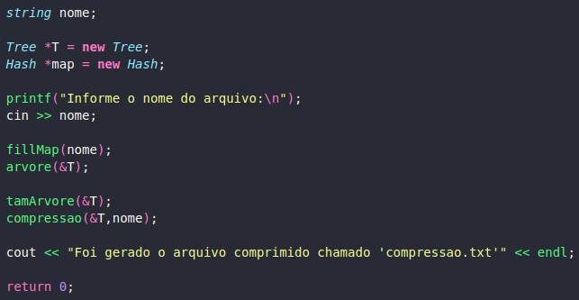

# Código de Huffman

Uma das melhores técnicas de compressão conhecidas é devido ao Huffman. Para uma dada distribuiçãao de probabilidades gera um código ótimo, livre de prefixo e de redundância mínima, além de produzir uma sequência de bits aleatórios. Utiliza códigos de tamanho variável para representar os símbolos do texto, que podem ser caracteres ou cadeias de caracteres (digramas, trigramas, n-gramas ou palavras). A ideia básica do algoritmo é atribuir códigos de bits menores para os símbolos mais frequentes no texto, e códigos mais longos para os mais raros.
  
  

O algoritmo de Huffman original baseia-se no método guloso e constrói um código ótimo com esforço computacional O(n.logn). Existem novas versões que constroem o código de Huffman com esforço computacional O(n), mas e necessário que as frequências já estejam ordenadas. Como o problema de ordenaçãao tem cota inferior Ω(n.logn), isto é, não existe um algoritmo que consiga ordenar as frequências com esforço computacional menor, o esforço computacional para construir o código de Huffman é Θ(n.logn).

  
| Símbolo  |  Frequência|                     
| :-------:| :-----------:|
| 0 | 0,20 |
| 1 | 0,25 |
| 2 | 0,15 |
| 3 | 0,08 |
| 4 | 0,07 |
| 5 | 0,06 |
| 6 | 0,05 |
| 7 | 0,05 |
| 8 | 0,05 |
| 9 | 0,04 |
  

  
<h2> Problema </h2>

Elabore uma árvore binária que utilize o código de Huffman para comprimir arquivos. Para tanto, (1) contabilizar a recorrência de cada palavra (RP) no arquivo; (2) normalizar a contabilização entre 0 e 1 utilizando a formula -> RP / (max(RP) - min(RP)); (3) Montar a árvore com as regras apresentadas por Huffman; (4) Troque as palavras pela codificação binária (utilizar booleano para representar 0 e 1); (5) Salve o arquivo em formato binário e observe qual foi o ganho de espaço obtido.

  
  

Elabore um Readme.mb explicando toda lógica utilizada na implementação, bem como, exemplos para representar funcionalidades da aplicação. Feito isso, demonstre um desses exemplos em execução para detalhar para o leitor o que ele deve esperar como saída. Além disso, detalhe tudo que for importante no código e mostre como deve ser compilado.

  
<h2> Resolução </h2>

Uma parte da resolução do problema foi baseada de [Tokenizacao](https://github.com/Kingdrasill/Tokenizacao) e deu-se por meio de alguns métodos para auxiliar na solução. Estes métodos são: <i>stockMap()</i>, <i>arvore()</i>, <i>tamArvore()</i> e <i>compressao()</i>.

  

Primeiramente, em <i>stockMap()</i>, fica responsável por ler o arquivo que o usuário informar. Além disso, usa o "umap" para definir chaves das palavras já percorridas. No método <i>arvore()</i>, gera uma árvore preenchendo-a com a Hash guardando os digitos e caracteres repetitivos.

  

O método <i>tamArvore()</i>, com base na codificação de Huffman, preenche a árvore de acordo com o valor de cada palavra do arquivo inserido pelo usuário. E, por fim,  <i>compressao()</i>, adiciona no arquivo "compressao.txt" os valores finais alcançados pelo algoritmo de Huffman, escrevendo em números binários as soluções das funções de procurar na Hash a tradução de cada palavra como vetor booleano.

    

 

<h2>Exemplo de Execução</h2>

Ao informar o nome do arquivo com a extensão, o programa o abre normalizando a contabilização e gera um arquivo com números binários representado cada palavra do texto ignorando algumas stop words.

    

 

    

 

<h2>Compilação e Execução</h2>

O progama disponibilizado possui um arquivo Makefile que realiza todo o procedimento de compilação e execução. Para tanto, temos as seguintes diretrizes de execução:

| Comando                |  Função                                                                                           |                     
| -----------------------| ------------------------------------------------------------------------------------------------- |
|  `make clean`          | Apaga a última compilação realizada contida na pasta build                                        |
|  `make`                | Executa a compilação do programa utilizando o gcc, e o resultado vai para a pasta build           |
|  `make run`            | Executa o programa da pasta build após a realização da compilação                                 |
